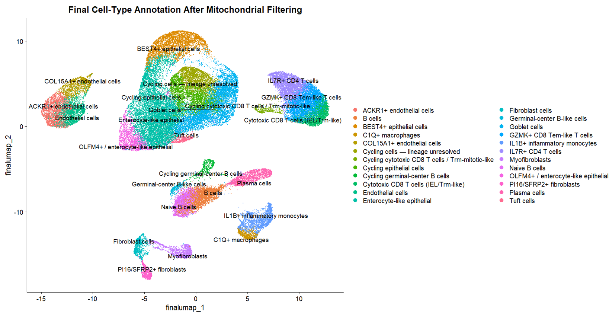

# GSE205506_IL1B_CD8
Post-treatment single-cell RNA-seq analysis of GSE205506 to investigate IL1B⁺ monocyte–CD8⁺ T-cell ligand–receptor interactions associated with tumor response to PD-1 blockade

## The Question

Which ligand–receptor interactions between IL1B+ monocytes and CD8+ T cells are associated with differential tumor response to PD-1 blockade in dMMR/MSI-H colorectal cancer?

## The Data

The dataset was obtained from the published study:

Li J, Wu C, Hu H, et al. Remodeling of the immune and stromal cell compartment by PD-1 blockade in mismatch repair-deficient colorectal cancer. Cancer Cell. 2023.

- GEO accession: GSE205506
- GEO: https://www.ncbi.nlm.nih.gov/geo/query/acc.cgi?acc=GSE205506

### Download

Download the processed single-cell data from the GSE205506 GEO page. The `GSE205506_RAW.tar` archive contains the processed gene-expression matrices for the samples. Extract the files before running the analysis.

Raw data and large intermediate files are not stored in this GitHub repository.

## What We Did

Cell-level QC was performed on 324,020 cells using paper-based gene/UMI filters, followed by scDblFinder, leaving 183,601 singlets.  
 
Broad cell compartments were assigned using canonical markers to support mitochondrial filtering. The dataset was reduced from 80,158 to 63,635 cells by compartment-specific mitochondrial filtering.  
 
The filtered dataset was then re-clustered for DE-based final annotation including cell subtypes.

## How to Run It

Run the scripts in the following order:

1. `data_QC.R` —  Calculates QC metrics, applies the gene/UMI filters, removes predicted doublets with scDblFinder, and saves QC/doublet checkpoints.
2. `02_normalization_PCA`. — Performs normalization, identification of highly variable genes, scaling, and PCA.
3. `Broad annotation.` - Assigns broad cell compartments using canonical markers, producing the broad annotation and a checkpoint before mitochondrial filtering.
4. `Mitochondrial_Filtering.` - Calculates compartment-specific mitochondrial thresholds and removes high-mitochondrial cells, producing the 63,635-cell filtered dataset.
5. `Final_Annotation` — Re-normalizes and re-clusters the mitochondrial-filtered dataset, identifies final DE markers, and assigns final cell-type annotations based on DE marker evidence.
6. `05_CellChat_IL1B_CD8.R` — Performs ligand–receptor communication analysis between IL1B+ monocytes and CD8+ T cells.

### R

- R 4.6.1

### Packages used in the QC stage

| Package | Version |
|---|---:|
| Seurat | 5.5.1 |
| dplyr | 1.1.2 |
| ggplot2 | 4.0.3 |
| patchwork | 1.3.2 |
| Matrix | 1.7.6 |
| SingleCellExperiment | 1.34.0 |
| scDblFinder | 1.26.7 |

## Results
Figure 2. Final cell-type annotation after mitochondrial filtering, showing distinct epithelial, T-cell, B-cell, myeloid, endothelial, and fibroblast/stromal subpopulations.

---

## Team

- [Aya Ayman Abdullah](https://github.com/AyaAymanAbdullah)
- [Member 2](https://github.com/USERNAME2)
- [Member 3](https://github.com/USERNAME3)
