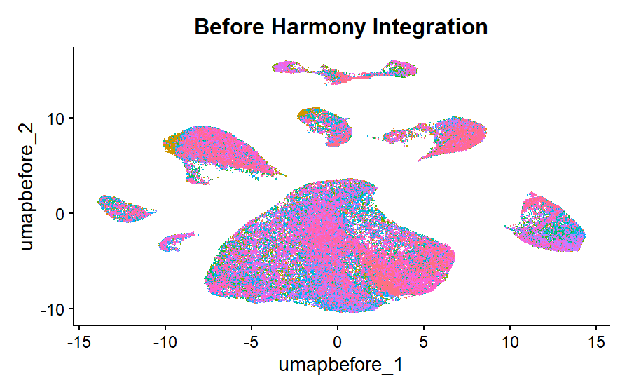

# GSE205506_IL1B_CD8
Post-treatment single-cell RNA-seq analysis of GSE205506 to investigate IL1B⁺ monocyte–CD8⁺ T-cell ligand–receptor interactions associated with tumor response to PD-1 blockade

## The Question

Which ligand–receptor interactions between IL1B+ monocytes and CD8+ T cells are associated with differential tumor response to PD-1 blockade in dMMR/MSI-H colorectal cancer?

## The Data

The dataset was obtained from the published study:

Li J, Wu C, Hu H, et al. Remodeling of the immune and stromal cell compartment by PD-1 blockade in mismatch repair-deficient colorectal cancer. Cancer Cell. 2023.

- GEO accession: GSE205506
- GEO: https://www.ncbi.nlm.nih.gov/geo/query/acc.cgi?acc=GSE205506

### Download

Download the processed single-cell data from the GSE205506 GEO page. The `GSE205506_RAW.tar` archive contains the processed gene-expression matrices for the samples. Extract the files before running the analysis.

Raw data and large intermediate files are not stored in this GitHub repository.

## What We Did

Cell-level QC was performed on 324,020 cells using paper-based gene/UMI filters, followed by scDblFinder, leaving 183,601 singlets.  
 
Merged the 40 samples (Seurat v5, one layer per sample) and log-normalized (scale factor 10,000).
 
Selected 2,000 HVGs (vst), computed in batches of layers to limit memory.
 
Downsampled to at most 2,060 cells per sample (from totally 183601 cells to 80158) because full scaling exceeded RAM.
 
Scaled the HVGs, regressed out nCount_RNA, ran PCA (20 PCs calculated, 15 used from the elbow plot).
 
Checked batch effects with a UMAP colored by GSM. Samples mixed, so Harmony was not applied.
 
Built the SNN graph (15 PCs) and clustered with Louvain at resolution 1.2 (30 clusters).
 
Broad cell compartments were assigned using canonical markers to support mitochondrial filtering. The dataset was reduced from 80,158 to 63,635 cells by compartment-specific mitochondrial filtering.  
 
The filtered dataset was then re-clustered for DE-based final annotation including cell subtypes.
For the targeted analysis, IL1B⁺ monocytes and CD8⁺ T cells were specifically identified from the final annotated dataset and restricted to post-treatment tumor samples with known clinical response.

Patients were stratified according to pathological complete response (pCR) or non-pCR.

The abundance of IL1B⁺ monocytes and CD8⁺ T cells was quantified at the patient level and compared between pCR and non-pCR groups.

Cell–cell communication was analyzed using CellChat separately in the pCR and non-pCR groups, focusing on ligand–receptor interactions between IL1B⁺ monocytes and CD8⁺ T cells.

Both directions of communication and self-signaling interactions were evaluated.

Inferred communication probabilities were compared between pCR and non-pCR groups to identify candidate ligand–receptor interactions associated with differential response to PD-1 blockade.

Patient-level analyses were performed to assess the consistency of the observed target-cell abundance patterns across individual patients.
## How to Run It

Run the scripts in the following order:

1. `01_data_QC.R` —  Calculates QC metrics, applies the gene/UMI filters, removes predicted doublets with scDblFinder.
2. `02_normalization_PCA`. — Performs normalization, identification of highly variable genes, downsampling, scaling, regression, PCA and clustering.
3. `03-Annotation and Mitocondrial filtration.R` - Assigns broad cell compartments based on canonical markers, providing an initial broad annotation before mitochondrial filtering.
    It then calculates compartment-specific mitochondrial thresholds and removes cells with high mitochondrial content, resulting in a filtered dataset of 63,635 cells.
    Finally, the filtered dataset is re-normalized and re-clustered, followed by identification of final DE markers and assignment of final cell-type annotations based on DE marker evidence.
4. `04-Targeted-analysis.R` —  Identifies IL1B⁺ monocytes and CD8⁺ T cells from the final annotated dataset, restricts the analysis to post-treatment tumor samples with known response, and compares target-cell abundance between pCR and non-pCR patients. It then performs CellChat analysis separately in pCR and non-pCR groups to evaluate ligand–receptor interactions between IL1B⁺ monocytes and CD8⁺ T cells, including both directions of communication and self-signaling, followed by comparison of inferred communication probabilities between response groups and patient-level analysis.

### R

- R 4.6.1

#
| Package | Version |
|---|---:|
| Seurat | 5.5.1 |
| dplyr | 1.1.2 |
| ggplot2 | 4.0.3 |
| patchwork | 1.3.2 |
| Matrix | 1.7.6 |
| SingleCellExperiment | 1.34.0 |
| scDblFinder | 1.26.7 |
| CellChat | 2.2.0.9001|

## Results
Figure 1. UMAP colored by GSM showing mixed samples clusters so no need harmony integration.

Figure 2. Final cell-type annotation after mitochondrial filtering, showing distinct epithelial, T-cell, B-cell, myeloid, endothelial, and fibroblast/stromal subpopulations.

Figure 3.Modeled ligand-receptor communication differences between IL1B⁺ monocytes and CD8⁺ T cells across response groups (pCR minus non-pCR).

## Team Contributions

| Team Member | Contributions | Scripts |
|---|---|---|
| Aya Ayman | Performed cell-level QC and doublet removal, broad cell annotation, compartment-specific mitochondrial filtering, final re-clustering, and DE-based final cell-type annotation. | `01_data_QC.R`, `03-Annotation and Mitocondrial filtration.R` |
| Shahd Karam | Performed normalization, highly variable gene selection, scaling, PCA, initial clustering, UMAP visualization, and sample-mixing assessment. | `02_normalization_PCA` |
| Maroua MILIANI | Performed targeted identification of IL1B⁺ monocytes and CD8⁺ T cells, selected the post-treatment tumor cohort, conducted CellChat analysis comparing pCR and non-pCR, and summarized ligand–receptor interactions and self-signaling. | `04-Targeted-analysis.R` |

## Team

- [Aya Ayman Abdullah](https://github.com/AyaAymanAbdullah)
- [Shahd Karam](https://github.com/ShahdKaram)
- [Maroua MILIANI](https://github.com/MarouaMILIANI)
